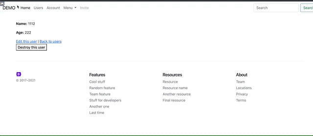

# Lazy Mobile Tester

[](https://www.railsjazz.com)
[](https://www.patreon.com/igorkasyanchuk)



"Laziness is the mother of progress" :)

We all know that we can use Chrome Dev Tools to check how app looks on a different resolutions.

But opening this tool, clicking, changing resolutions... It's just too many actions. 

I'm as developer want an easy way to check how webpage looks on a different resolutions. With a simple click.

This is why I've created a simple gem which opens webpage in iframe and allows you to change width of it.

## Usage

There are two ways how to use it:

1) with button in top left corner to open page in IFRAME. To do this add in your layout inside body tag:

```erb
    <%= lazy_mobile_tester_button if defined?(LazyMobileTester) %>
```

2) add a parameter to any URL `?_lazy=1` and open it. For example - `instead of /users just open /users?_lazy=1`


## Installation

Add this line to your application's Gemfile:

```ruby
gem "lazy_mobile_tester"
```

And then execute:
```bash
$ bundle
```

## Contributing

You are welcome to contribute.

## TODO

- tests?
- any other ideas?

## License

The gem is available as open source under the terms of the [MIT License](https://opensource.org/licenses/MIT).

[](https://www.railsjazz.com/?utm_source=github&utm_medium=bottom&utm_campaign=lazy_mobile_tester)
